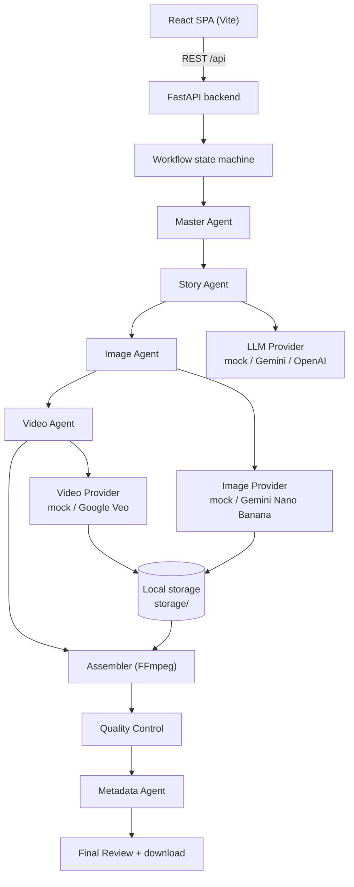

# AI Shorts Studio

Human-in-the-loop AI Shorts production studio. Turn an idea into a final MP4
plus YouTube title/description/hashtags through a multi-agent pipeline — with a
human approving every creative step. Uploading and publishing to YouTube stays
intentional and manual.


> **Mock mode by default** — the entire pipeline runs end-to-end with zero cost
> and no API keys, so you can try it immediately.

## Features

- **Multi-agent pipeline** — Master → Story → Image → Video → Assembly → QC →
  Metadata, each with a clear responsibility.
- **Human-in-the-loop checkpoints** — approve the storyboard; pick the best
  image per scene; review the final MP4 + YouTube metadata before keeping it.
- **Ships in mock mode** — deterministic storyboard, PNG candidate images, and
  FFmpeg-rendered MP4 clips with no paid calls.
- **Real providers behind one abstraction** — OpenAI-compatible LLMs, Google
  Gemini (LLM + Nano-Banana images), Google Veo (image-to-video). No silent
  fallbacks: failures surface explicit typed errors.
- **Structured output** — Gemini JSON-schema mode and OpenAI `json_schema` for
  reliable storyboards, Project Bibles and metadata.
- **Reactive dashboard** — live stage progress with per-stage next-action
  guidance on a React + Vite frontend.
- **Secret-safe by design** — keys live only server-side in the environment and
  never reach the frontend, logs, or error responses.

## Try it (2 minutes, free)

```bash
# 1. Backend
python3 -m venv .venv && source .venv/bin/activate
pip install -r requirements.txt
cp .env.example .env        # mock mode is the default — no keys needed
uvicorn backend.api:app --reload --port 8000

# 2. Frontend (new terminal)
cd frontend
npm install
npm run dev
```

Open **http://localhost:5173**, start a production with any idea, and watch it
flow through the pipeline. API docs: http://localhost:8000/docs.

## Screenshots

> Drop images into `docs/screenshots/` and reference them here to showcase the
> dashboard, workspace, and final review screens.

## Architecture



Providers, agents, the workflow state machine, frontend and storage are
decoupled: plugging in a new vendor never touches the agents or UI.

## Workflow

```
User idea
→ Master Agent
→ Story Agent (storyboard + Project Bible)
→ storyboard approval
→ image generation
→ user selects one of two images per scene
→ video/animation generation
→ automatic video assembly
→ quality control
→ YouTube title + description + hashtags
→ final review
→ download / keep final MP4
```

## Prerequisites

- **Python 3.11+** (tested on 3.13)
- **Node.js 18+** and **npm** (for the frontend)
- **FFmpeg** (recommended) — used by the mock video provider and the
  assembler to render real MP4 clips.

### Installing FFmpeg

- macOS (Homebrew): `brew install ffmpeg`
- Ubuntu/Debian: `sudo apt install ffmpeg`
- Windows: download from https://ffmpeg.org and add to your PATH

Verify with: `ffmpeg -version`

## Environment setup

1. Clone/copy this project.
2. Create a `.env` file from the example:

```bash
cp .env.example .env
```

3. Edit `.env` with your own values (see below). `.env` is gitignored and must
   never be committed.

### .env configuration

The V1 ships in **mock mode** by default, so the whole workflow runs without any
paid API calls or API keys.

```bash
# LLM
LLM_PROVIDER=mock          # or "gemini" (recommended) / "openai"
LLM_API_KEY=               # for OpenAI; for Gemini use GEMINI_API_KEY below
LLM_MODEL=                 # default: gemini-2.5-flash (Gemini) / gpt-4o-mini (OpenAI)
LLM_BASE_URL=
# LLM_TIMEOUT=120

# Image
IMAGE_PROVIDER=mock        # or "google" (Gemini Nano Banana, paid credits)
IMAGE_API_KEY=
IMAGE_MODEL=               # default gemini-3.1-flash-image
IMAGE_BASE_URL=
# IMAGE_TIMEOUT=120

# Video
VIDEO_PROVIDER=mock        # or "google" (Veo image-to-video, paid credits)
VIDEO_API_KEY=
VIDEO_MODEL=               # default veo-3.1-generate-preview
VIDEO_BASE_URL=
# VIDEO_TIMEOUT=60
# VIDEO_POLL_TIMEOUT=1800
# VIDEO_POLL_INTERVAL=10

# Google Gemini (shared) — used by LLM (LLM_PROVIDER=gemini), IMAGE_API_KEY,
# and VIDEO_API_KEY when left empty.
# IMPORTANT: consumer Gemini/ChatGPT/Google One subscriptions do NOT provide
# API credits — you need a Google Cloud / AI Studio API key.
GEMINI_API_KEY=

# Database / storage
DATABASE_URL=
STORAGE_PATH=

# Retry (optional)
RETRY_ATTEMPTS=3
RETRY_BACKOFF=1.0
RETRY_MAX_DELAY=30.0
```

> Backward compatible: if `LLM_*` are empty, the older `AI_API_KEY`,
> `AI_MODEL`, `AI_PROVIDER`, `AI_BASE_URL` variables are honored. The Google
> image/video providers also honor the legacy `GOOGLE_API_KEY` variable when
> neither `IMAGE_API_KEY`/`VIDEO_API_KEY` nor `GEMINI_API_KEY` is set.

### Gemini LLM setup

When `LLM_PROVIDER=gemini`, the app uses Google Gemini for story generation via
the Gemini API `generateContent` endpoint. To set it up:

1. Obtain a Gemini API key from [Google AI Studio](https://aistudio.google.com/apikey)
   or Google Cloud Vertex AI.
2. Set `GEMINI_API_KEY` (or `GOOGLE_API_KEY` / legacy `LLM_API_KEY`) in your
   `.env`.
3. Optionally set `LLM_MODEL` — the default fallback is `gemini-2.5-flash`.
4. Run the smoke test to verify connectivity (costs 1 small structured request):
   ```bash
   GEMINI_API_KEY='your-key' python3 scripts/gemini_smoke_test.py
   ```

**Important constraints when using Gemini:**

- The app will **never silently fall back** to OpenAI or any other provider if
  Gemini fails. On authentication errors, quota exhaustion, or model-not-found,
  generation stops and an explicit error (e.g. `GEMINI_QUOTA_EXCEEDED`) is
  reported.
- Temporary rate limits (`GEMINI_RATE_LIMITED`) are retried with exponential
  backoff. Quota exhaustion is NOT retried.
- Consumer Gemini / ChatGPT / Google One / Google One AI Premium subscriptions
  do not provide API credits. The API key must come from AI Studio or a Google
  Cloud project with the Gemini API enabled.

## Mock mode

Set the provider to `mock` to develop and test with zero cost:

- `LLM_PROVIDER=mock` — returns a deterministic storyboard + Project Bible.
- `IMAGE_PROVIDER=mock` — writes two distinct PNG candidate images per scene.
- `VIDEO_PROVIDER=mock` — renders a short MP4 clip per scene using FFmpeg.

The `backend/health` endpoint reports each dependency's status
(`CONFIGURED` / `READY` / `NOT_CONFIGURED` / `ERROR`) and never returns secrets.

## How providers are configured

- `backend/config.py` — reads and validates all env configuration.
- `backend/providers/registry.py` — maps `*_PROVIDER` names to implementations,
  validates configuration, and exposes capability introspection.
- `backend/providers/base.py` — provider interfaces (`LLMProvider`,
  `ImageProvider`, `VideoProvider`), shared result models, standardized
  `GenerationOptions`, the generic async-job abstraction, and capability
  metadata.
- `backend/providers/http.py` — reusable HTTP client with timeout, retries and
  exponential backoff.
- `backend/providers/` — concrete implementations:
  - `llm.py` — OpenAI chat-completions client + mock.
  - `gemini.py` — Google Gemini LLM via generateContent (text + JSON-schema structured output).
  - `image.py` — mock image provider.
  - `google_image.py` — Gemini Nano-Banana image generation (generateContent).
  - `video.py` — mock video provider.
  - `google_veo.py` — Veo image-to-video generation (predictLongRunning).
  - `http.py` — reusable HTTP client with timeout, retries, exponential
    backoff and provider-specific error mapping.

### Provider abstraction

The provider layer is decoupled from the agents so the Master Agent, Story
Agent, workflow state machine, frontend and storage never change when a new
vendor is plugged in. All generation flows through the abstract interfaces in
`backend/providers/base.py`:

- **`ImageProvider`** — text-to-image generation, multiple candidates, image
  dimensions / aspect ratio, model selection, generation parameters, output
  references, generation ID + status, provider-specific errors.
- **`VideoProvider`** — image-to-video generation, animation prompt, duration,
  aspect ratio, model selection, output reference, generation ID + status,
  provider-specific errors.
- **`GenerationOptions`** — standardized, provider-agnostic options
  (`width`, `height`, `aspect_ratio`, `duration_seconds`, `model`, `quality`,
  `seed`, `params`).
- **Generic async jobs** — `AsyncJob`, `AsyncPollingClient`, `AsyncImageProvider`
  and `AsyncVideoProvider` provide a submit → job id → poll → result pattern for
  providers that require polling. The mock providers also expose this surface,
  returning an immediately-successful job.

### Capability metadata

Each provider declares capabilities (e.g. image: `text_to_image`,
`multi_candidate`, `aspect_ratio_9_16`; video: `image_to_video`,
`duration_control`, `aspect_ratio_9_16`). Callers can check the configured
provider at runtime:

```python
from backend.providers.registry import provider_supports
provider_supports("image", "aspect_ratio_9_16")  # True
provider_supports("video", "text_to_image")      # False
```

### Configuration validation

If a real provider is selected but its required credentials/model are missing,
or its adapter is not implemented yet, the registry raises a clear
`ProviderNotConfiguredError` instead of silently falling back to mock. Health
reports the provider state distinctly: `NOT_CONFIGURED` (missing credentials),
`CONFIGURED` (configured but not yet verified live), `READY` (operational), or
`ERROR` (unsupported).

### Production adapters

Real adapters are implemented for OpenAI-compatible LLMs, Google Gemini images
(Nano Banana family) and Google Veo (image-to-video). Highlights:

- **`OpenAILLMProvider`** — chat completions + structured output
  (`response_format: json_schema`). Base URL, model and timeout are configurable
  via `LLM_BASE_URL` / `LLM_MODEL` / `LLM_TIMEOUT`.
- **`GoogleImageProvider`** — calls the Gemini API `generateContent` endpoint
  with `responseModalities: ["TEXT", "IMAGE"]` and the normalized aspect ratio
  (`9:16` by default). Two `generateContent` calls produce two candidate images.
  Images are decoded from `inlineData` and stored under `storage/google`; the
  result returns stable local paths, never transient provider URLs.
- **`GoogleVeoProvider`** — image-to-video via the `predictLongRunning`
  endpoint. Submit → operation id → poll → download the generated MP4 from its
  temporary `uri` into local storage. Duration clamps to Veo's supported values
  (4/6/8s; image-to-video uses 8s). Async surface
  (`submit_async`/`poll_async`/`wait`) and a synchronous `generate_video`
  convenience are both available.
- **Error mapping** — every adapter translates upstream failures (auth, invalid
  request, quota/rate limit, safety block, upstream unavailable) into a specific
  `ProviderError` subclass via `http.py`'s `error_parser`. Secrets are never
  included in error messages.
- **Smoke test** — `scripts/smoke_test.py` runs a single real (paid) call per
  configured provider. It is intentionally separate from the automated suite;
  see its header before running.

## Backend startup

```bash
python3 -m venv .venv && source .venv/bin/activate
pip install -r requirements.txt
uvicorn backend.api:app --reload --port 8000
```

API docs are available at http://localhost:8000/docs.

## Frontend startup

```bash
cd frontend
npm install
npm run dev
```

Open http://localhost:5173. The Vite dev server proxies `/api` to the backend
at `http://localhost:8000`.

## Testing

```bash
# Backend tests
python3 -m pytest tests/ -v

# Frontend build check
cd frontend && npm run build
```

## Health checks and secret safety

- `GET /health` — reports database, storage, FFmpeg, LLM, image and video
  provider status as `CONFIGURED` / `READY` / `NOT_CONFIGURED` / `ERROR`. It
  never includes API keys.
- `GET /settings` — non-secret configuration summary for the frontend Settings
  view.

API keys exist only on the backend, are read from environment variables, are
never sent to the frontend, never logged, and never appear in error responses.

## Storage layout

Projects persist to JSON under `storage/projects/` (existing flat files stay
compatible). Each project also gets an asset directory tree:

```
storage/projects/
  <project_id>.json          # project record (workflow state, story, metadata)
  <project_id>/
    storyboard/
    images/
    videos/
    final/
    metadata/
    qc/
```

## License

[MIT](LICENSE)